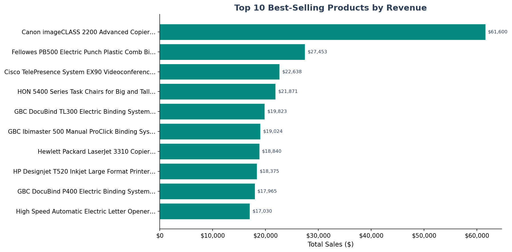
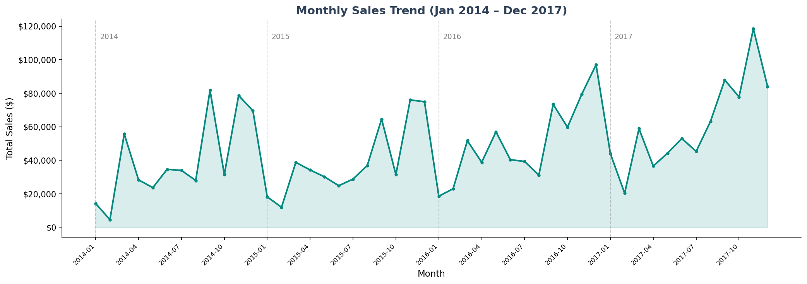
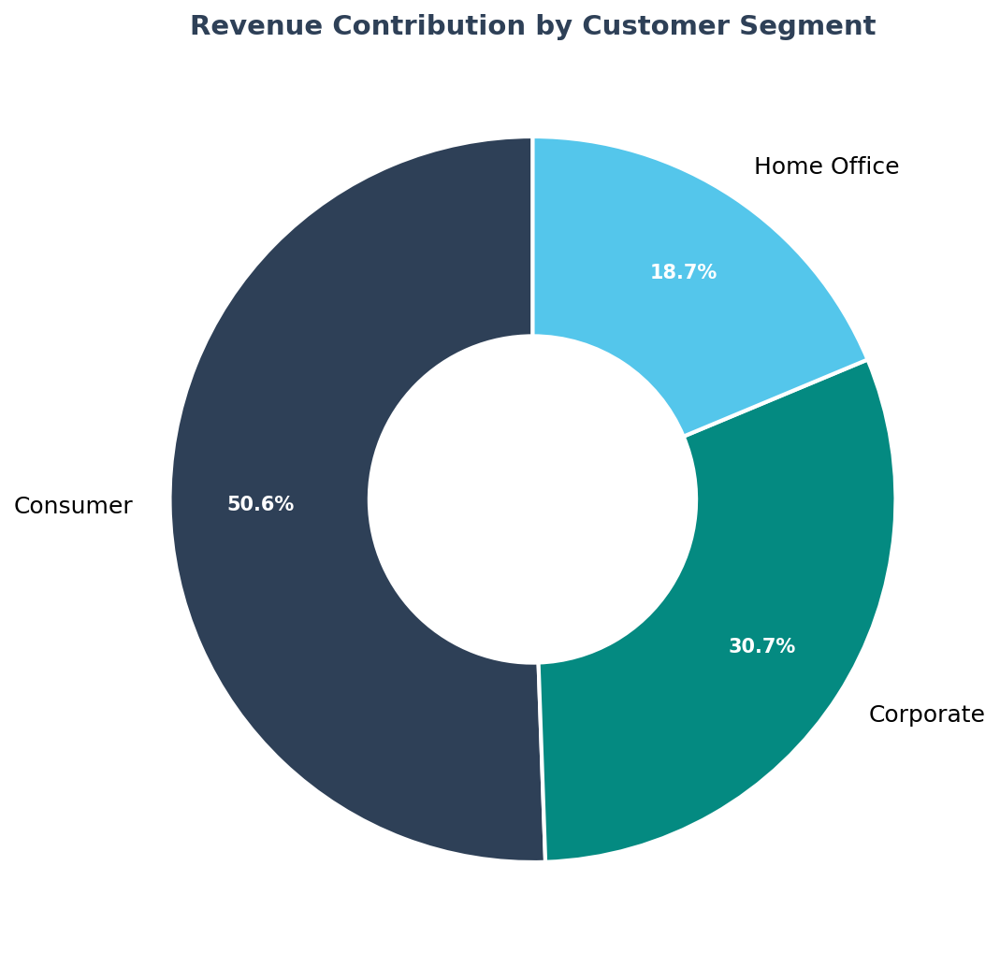
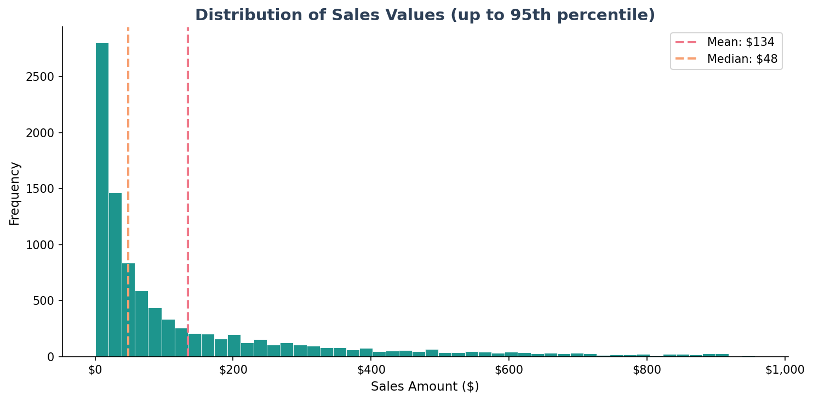
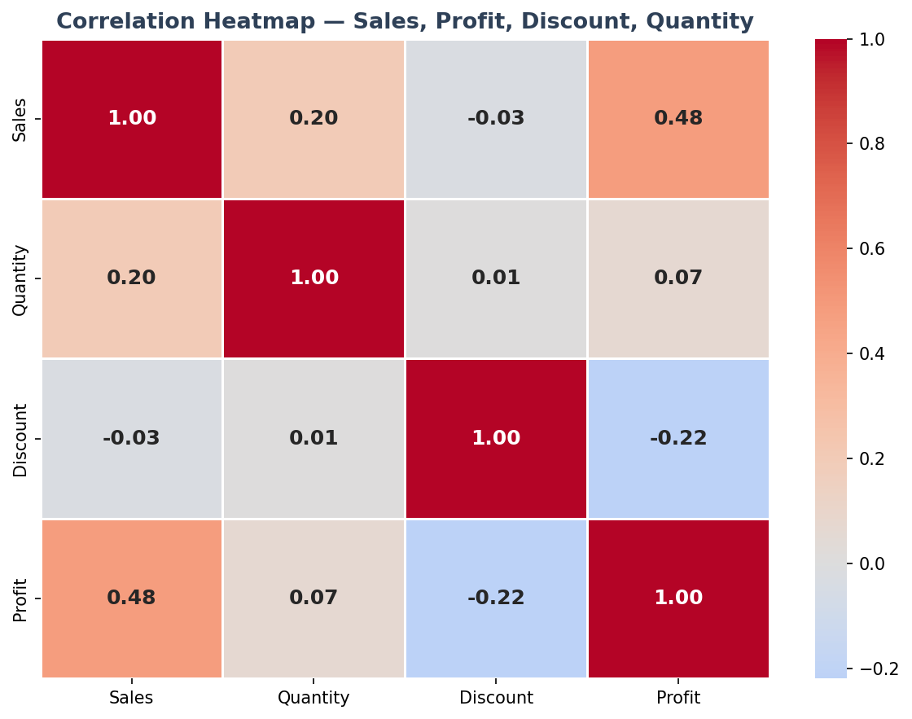
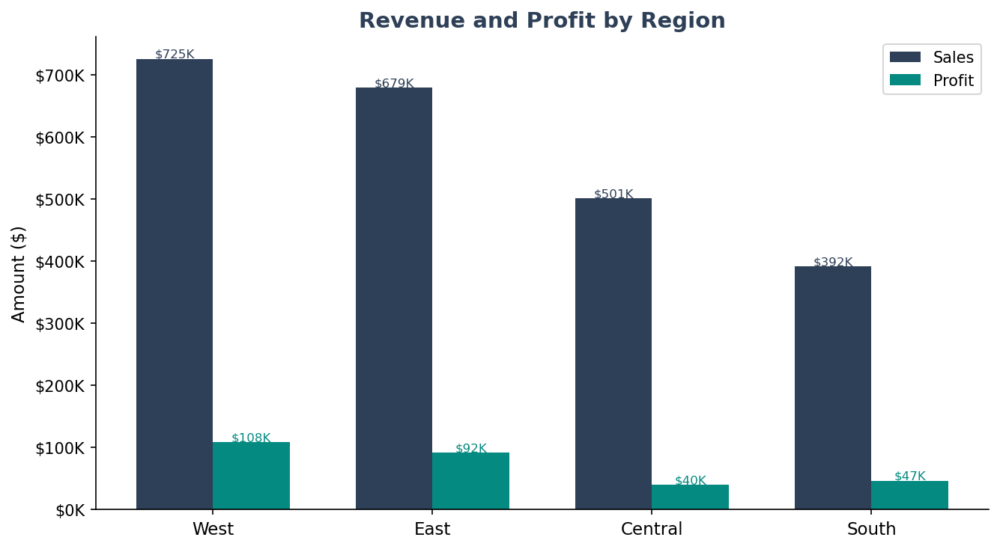
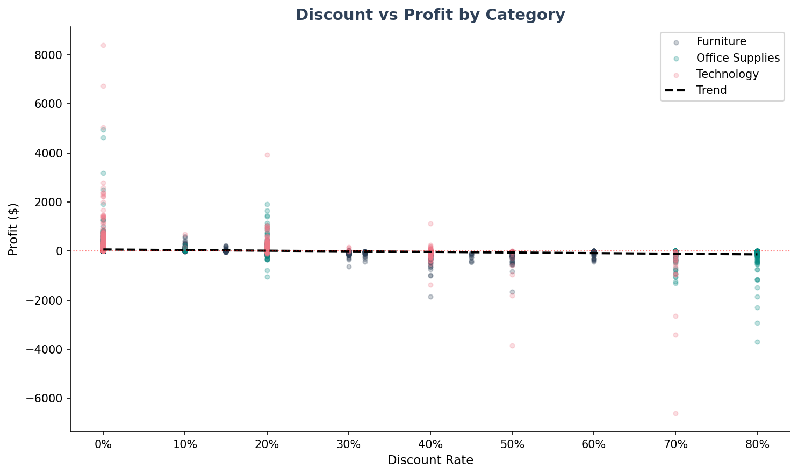

# Super Store Sales Data Analysis

> A comprehensive retail sales analysis of 9,994 transactions across the United States (January 2014 – December 2017), uncovering revenue patterns, customer behaviour, regional performance, and the true impact of discounting on profitability.

---

## Project Overview

This is a full end-to-end data analytics capstone project analysing the Super Store retail dataset. The objective was to perform structured data inspection, cleaning, and exploratory analysis to produce actionable business insights and recommendations for management.

The project covers the complete analytics workflow — from raw data profiling and cleaning in Python, through exploratory data analysis with 7 visualizations, to a written business report, Excel scorecard, and executive PowerPoint presentation.

| Item | Detail |
|------|--------|
| **Period** | January 2014 – December 2017 |
| **Dataset** | Sample - Superstore |
| **Total Records** | 9,994 orders |
| **Total Columns** | 21 fields |
| **Categories** | Furniture · Office Supplies · Technology |
| **Regions** | West · East · Central · South |

---

## Dataset

The Super Store dataset contains order-level retail transaction records from a US-based retail company. It captures customer orders across three product categories, three customer segments, and four geographic regions over four years.

| Column Group | Fields |
|-------------|--------|
| Order Information | Order ID, Order Date, Ship Date, Ship Mode |
| Customer Information | Customer ID, Customer Name, Segment, City, State, Region |
| Product Information | Product ID, Category, Sub-Category, Product Name |
| Financial Metrics | Sales, Quantity, Discount, Profit |

---

## Data Quality Issues Resolved

- Confirmed zero missing values across all 21 columns
- Confirmed zero duplicate records
- Standardised date columns and converted to proper datetime format
- Engineered new date features: Order Year, Order Month, Order Quarter, Year-Month
- Standardised all text columns — stripped whitespace and applied consistent title case
- Verified all Sales values were positive — no invalid entries found
- Retained negative Profit rows as valid loss-making transactions caused by heavy discounting
- Removed two irrelevant columns: Row ID (sequential index) and Country (single value)
- Exported cleaned dataset as `superstore_cleaned.csv`

---

## Key Metrics

| Metric | Value |
|--------|-------|
| Total Revenue | $2,297,201 |
| Total Profit | $286,397 |
| Profit Margin | 12.47% |
| Total Orders | 5,009 |
| Average Order Value | $229.86 |
| Total Customers | 793 |
| Units Sold | 37,873 |

---

## Exploratory Data Analysis

**Product Analysis**
- Technology is the highest-revenue category at $836,154 with a 17.4% profit margin
- Furniture generates $741,999 in revenue but has a critically low 2.5% profit margin
- Office Supplies matches Technology's efficiency at 17.0% margin
- Canon imageCLASS 2200 Advanced Copier is the top-selling individual product
- Bottom 10 products each generated under $20 in total sales across 4 years

**Customer Analysis**
- Consumer segment drives 50.6% of total revenue across 410 customers
- Corporate segment contributes 30.7% with a 13.0% profit margin
- Home Office is the most margin-efficient segment at 14.0%

**Sales Analysis**
- Consistent Q4 (Oct–Dec) revenue spikes visible across all four years
- West region leads in both revenue ($725K) and profit ($108K)
- Central region underperforms — 21.8% revenue share but disproportionately low profit
- Year-on-year revenue growth with 2017 achieving the highest monthly peaks

**Discount Analysis**
- Discount vs Sales correlation: +0.005 — discounts do not meaningfully boost sales
- Discount vs Profit correlation: −0.219 — discounts consistently destroy margin
- Discounts above 40% almost universally produce losses
- Furniture carries the highest average discount (16.5%) and lowest average profit per order ($8.73)

---

## Business Insights

**Which category generates the highest revenue?**
Technology — $836,154 in revenue with a 17.4% margin. The clear portfolio leader in both revenue and profitability.

**Which customer segment is most profitable?**
Consumer in absolute profit ($134,119). Home Office leads on margin efficiency at 14.0% making it the most valuable per-customer segment.

**Do discounts increase sales significantly?**
No. Correlation with sales is +0.005 — essentially zero. Discounts have a strong negative impact on profit at −0.219. They are not an effective sales lever.

**Which products should receive more marketing attention?**
Technology products — Phones, Copiers, and Machines — are already the strongest performers and should receive continued investment. Bottom 10 products should be reviewed for discontinuation rather than marketing spend.

**Which regions should be prioritised for growth?**
Central region. It generates 21.8% of revenue but a disproportionately low share of profit, pointing to fixable pricing and operational inefficiencies.

---

## Recommendations

1. **Cap all discounts at 20%** — Discounts above 40% produce consistent losses. Replace blanket discounting with volume-based incentives and seasonal promotions.
2. **Invest in the Technology category** — Highest revenue and best margin. Expand inventory and marketing for Phones and Copiers.
3. **Launch a Consumer segment loyalty programme** — Consumer drives 50.6% of revenue. Loyalty rewards will increase repeat purchases and lifetime value.
4. **Fix Central region operational efficiency** — Review pricing, discount frequency, and logistics in Central states to improve its profit share.
5. **Implement a quarterly product performance review** — Bottom-performing products tie up capital. Discontinue products with no improvement trend over two quarters.
6. **Plan proactively for Q4 demand spikes** — Begin inventory build-up and staffing preparation from September each year to prevent stockouts during peak trading.

---

## Visualizations

### Top 10 Best-Selling Products


### Monthly Sales Trend (2014–2017)


### Revenue by Customer Segment


### Distribution of Sales Values


### Correlation Heatmap — Sales, Profit, Discount, Quantity


### Revenue & Profit by Region


### Discount vs Profit by Category


---

## Running the Python Script

### Requirements

```bash
pip install pandas numpy matplotlib seaborn openpyxl
```

### Run the Notebook

```bash
jupyter notebook superstore_analysis.ipynb
```

Make sure `super store.xlsx` is in the same folder as the notebook before running. All 7 visualizations will be saved automatically as PNG files when you run all cells.

---

## About the Analyst

**Idumhanlena Ehizojie Efosa**

A certified Data Analyst, proficient in analytical tools

This capstone project applies structured data analytics methodology to a real-world retail business context, combining evidence-based thinking from a clinical background with data-driven decision making.

---

## Licence

This project is an academic and professional capstone. The Super Store dataset is a publicly available sample dataset used for educational purposes.

---

*Super Store Sales Analysis · Osadeba Enobakhare · June 2026*
